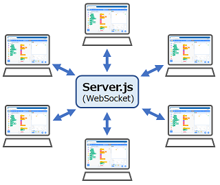

# Scratch拡張機能（無線）

- [sc3-radio](https://github.com/marron9999/sc3-Radio/)から接続するWebSocketサーバー

【注意】

- インターネット上に配置して利用することは想定しておりません。 
- イントラネット（サブネット内など）に配置して利用してください。

### server.js

Scratch拡張機能（無線）から接続するWebSocketサーバーです。 
デフォルトのポート番号は「8888」です。

起動方法： node server.js  [ポート番号]

### server.html

server.jsに接続して、接続しているクライアントの状態を確認したい場合に使ってください。

### client.html

server.jsに接続して、特定のバンド、グループのクライアントの状態を確認したい場合に使ってください。 
バンドを変更する場合は「band バンド番号」をSendボタンで送信してください。 
グループを変更する場合は「group グループ番号」をSendボタンで送信してください。 
バンドは「0」～「83」、グループは「0」～「255」が使えます。

### Scratch拡張機能（無線）

- 無線機能では、バンドとグループで決められた送信を受信することができます。
- バンドは「0」～「83」、グループは「0」～「255」が使えます。
- 無線機能で利用できるブロックは以下です。

#### バンドを[BAND]にする

利用するバンドを 0 ～ 83 に設定します。 
初期値は 0 です。

#### グループを[GROUP]にする

利用するグループを 0 ～ 255 に設定します。 
初期値は 0 です。

#### 数値[VALUE]を送信する

数値(指定したVALUE)を送信します。

#### 文字列[VALUE]を送信する

文字列(指定したVALUE)を送信します。

#### データ[NAME]=[VALUE]を送信する

データ（指定したNAME=VALUE)を送信します。

#### 受信したとき

数値、文字列、データのいずれかを受信した場合、真 を返します。 
いずれも受信していない場合、偽 を返します。

#### 受信した形式

数値を受信した場合、N を返します。 
文字列を受信した場合、S を返します。 
データを受信した場合、V を返します。 
いずれも受信していない場合、空文字列 を返します。

#### 受信した数値

受信した数値を返します。 
受信が数値でない場合、-1 を返します。

#### 受信した文字列

受信した文字列を返します。 
受信が文字列でない場合、空文字列を返します。

#### 受信したデータ

受信したデータを 名前=値　という文字列で返します。 
受信がデータでない場合、空文字列を返します。

#### データ[DATA]の名前部

データから名前部（=の左側）の文字列を返します。 
データに = が含まれていない場合、空文字列を返します。

#### データ[DATA]の値部

データから値（=の右側）の数値を返します。 
データに = が含まれていない場合、-1 を返します。

#### 固有名

通信時に割り当てられた固有名を返します。 
固有名は、IPV4アドレスと識別値を表した文字列です。

#### シリアル番号

通信時に割り当てられたシリアル番号を返します。 
シリアル番号は、固有名を16進数で表した文字列です。

